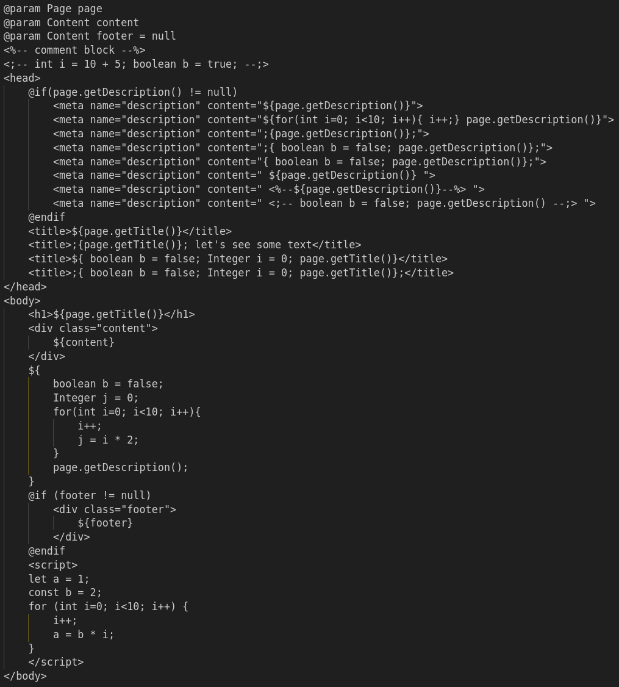
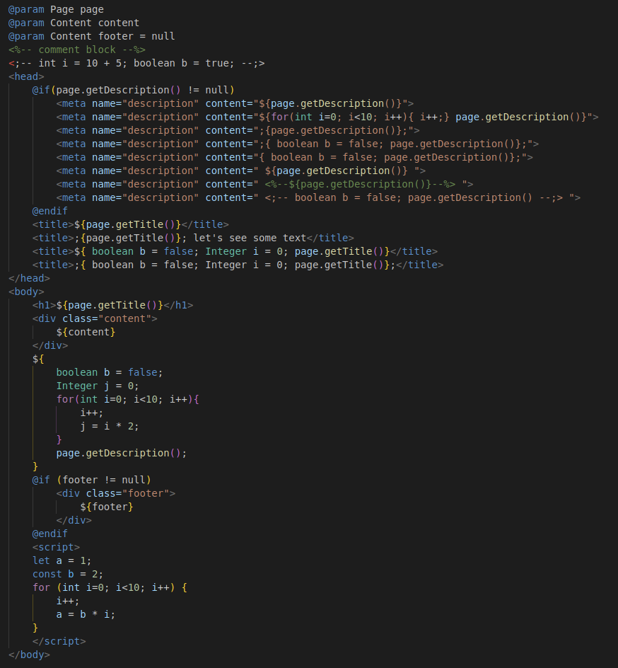

# JTE template syntax highlight

This is a vscode extention for JTE template syntax highlight.

## Features

Based on HTML syntax and extended with embedded languages CSS, Javascript and Java.

JTE test template without highlights:

JTE test template with highlights:

## Requirements

No requirements or dependencies.

## Extension Settings

No specific extension settings.

## Known Issues

No known issues.

## Release Notes

This is the initial release covering the syntax highlighting.

### 1.0.0

Initial release.

-----------------------------------------------------------------------------------------------------------

## References

* [JTE official website](https://jte.gg/)
* [Language Extensions Overview](https://code.visualstudio.com/api/language-extensions/overview)
* [Publishing Extensions](https://code.visualstudio.com/api/working-with-extensions/publishing-extension)
* [Visual Studio Code's Markdown Support](https://code.visualstudio.com/docs/languages/markdown)
* [Markdown Syntax Reference](https://help.github.com/articles/markdown-basics/)

**Enjoy!**
